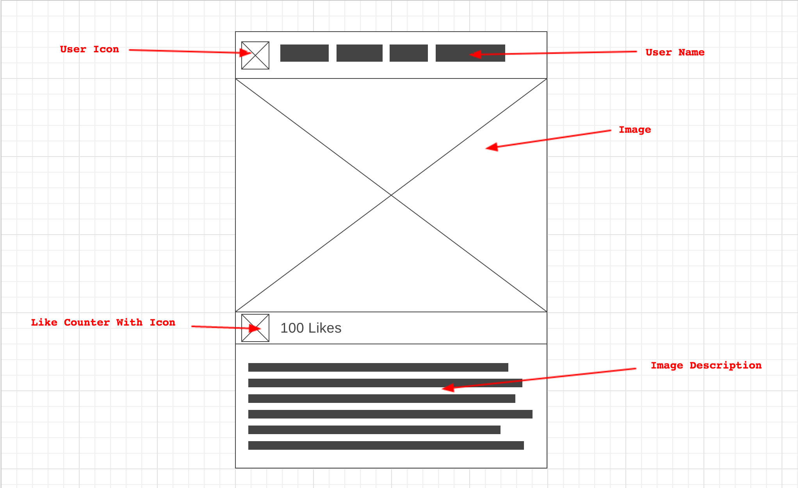
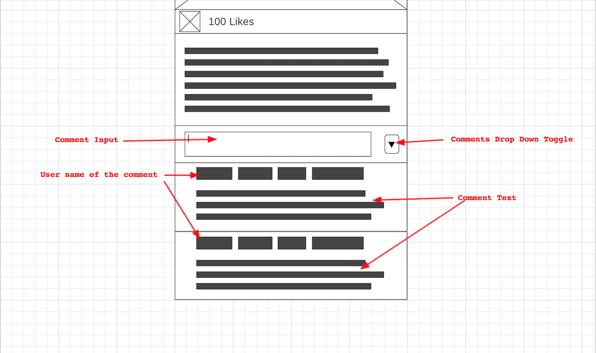

# InstaGallery

## Description

A simple web page designed using React that displays images posted by users in a feed.

## Process

### Page Layout

Basic layout of the page and arrangement of components



Layout of webpage with bonus features incorporated




### User Stories
```
As an instaGallery user, 
I want to see a feed of photos from other user, 
So that I can see what content users are sharing.

As an instaGallery user,
I want to see a photo a another user has taken,
So that i can appreciate their photography.

As an instaGallery user, 
I want to see a users alias/name, 
So that I know who added the photo to the gallery.

As an instaGallery user, 
I want to see a users avatar, 
So that I can familiarise myself with the user.

As an instaGallery user, 
I want to see a description of the photo, 
So that I learn more about the photos content.

As an instaGallery user, 
I want to the ability to like the photo, 
So that I can show my appreciation for a photo that I like.

As an instaGallery user, 
I want to the see how many likes a photo has, 
So that I can see how popular a photo is with other users.

```

### Bonus

```
As an instaGallery user, 
I want to be able to unlike a photo in my feed, 
So that I can undo a like made by accident.

As an instaGallery user, 
I want to be able to delete a users card from my feed, 
So that I have more control of the content I like.
```

### Problems encountered

* How to test child components?
    Attempting to mock child components and test that they are rendered within the wrapper as do not need to test the behaviour or appearance of the child components from the parent test file.

    Found potential in using a Babel plugin Rewire that replaces the render child components with mocks. Then found that simply the shallow rendering of enzyme will actually partially render the child components, without adding any of their behaviour, allowing you to test for their presence.