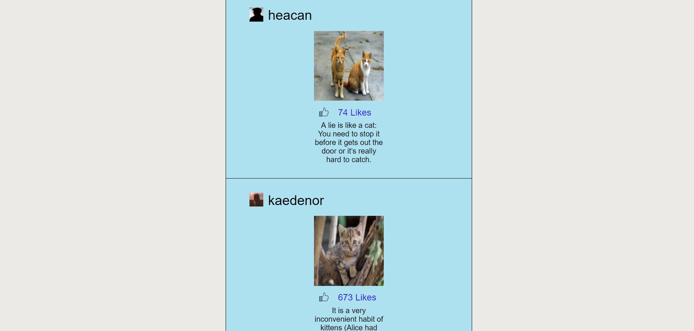

# InstaGallery

## Description

A simple front end web page app designed using React that displays images posted by users in a feed. Users are able to like/unlike a post.

The project uses [Create React App](https://github.com/facebook/create-react-app) and bootstrap for the design and layout.

You can check out my [Process](#process) and [Problems Encountered](#problems) to see my approach to this challenge, and how I solved (hopefully) the issues I faced along the way.
You can also see my [Retrospective](#retrospective) to see what I thought went well, what could be improved and what I would do with more time.


## Product



## Process

## Page Layout

Basic layout of the page and arrangement of components


Layout of webpage with bonus features incorporated


## User Stories
```
As an instaGallery user, 
I want to see a feed of photos from other user, 
So that I can see what content users are sharing.

As an instaGallery user,
I want to see a photo a another user has taken,
So that i can appreciate their photography.

As an instaGallery user, 
I want to see a users alias/name, 
So that I know who added the photo to the gallery.

As an instaGallery user, 
I want to see a users avatar, 
So that I can familiarise myself with the user.

As an instaGallery user, 
I want to see a description of the photo, 
So that I learn more about the photos content.

As an instaGallery user, 
I want to the ability to like the photo, 
So that I can show my appreciation for a photo that I like.

As an instaGallery user, 
I want to the see how many likes a photo has, 
So that I can see how popular a photo is with other users.

```

### Bonus Stories

```
As an instaGallery user, 
I want to be able to unlike a photo in my feed, 
So that I can undo a like made by accident.

As an instaGallery user, 
I want to be able to delete a users card from my feed, 
So that I have more control of the content I like.
```

## Problems

* How to test child components?
    Attempting to mock child components and test that they are rendered within the wrapper as do not need to test the behaviour or appearance of the child components from the parent test file.

    Found potential in using a Babel plugin Rewire that replaces the render child components with mocks. Then found that simply the shallow rendering of enzyme will actually partially render the child components, without adding any of their behaviour, allowing you to test for their presence.

* How to add a suitable key to each Post component?
    Solved this issue by adding an index in to the mapping function of the json file imported in to the Postfeed component. This index is then assigned to each Post rendered. This is a less than ideal solution as it relies upon each post being rendered in exactly the same order each time as otherwise the key will change for each post. However in this example the order will stay the same so it is acceptable. If an ID for each post had been provided, perhaps if the posts were stored in a database and the ID added to the json response, then that would provide a unique identifier and would be a suitable replacement for just using the index. Still unsure of how to test this, or if it is even necessary.

* Is it necessary to test if props from a parent component?
    Postfeed passing props to Post which passes props to Username; this is a feature of React, so it does not seem necessary to test this. I only need to test the outcome of passing these props, which is that Username renders the props correctly.


## Retrospective

### What went well
 *   Functionally, the components all interact with each other with good adherence to the single responsibility principle.
 *   Flow of information from the json file, to the higher order components down to the child components is concise and readable.
 

### What could be improved
*   The testing of the components' behaviour and state; ensuring all behaviour/state/responsibility of each component is thoroughly tested.
*   The style could be improved in many ways, such as the colour palette etc.
*   The design is fitted to one size screen, it is not dynamic and would need some attention to remedy this.
*   There is no current indication of whether the user has already liked a post or not, so a notification or change to the like icon could solve this problem.
*   Some components have a state, but don't actually use their state so may not be necessary.

### What I would do with more time

* Reevaluate what tests are strictly necessary to assess if a component's responsibility is being correctly carried out, and implement these tests.
* Investigate and implement dynamic rendering of the post component to correctly display the Postfeed on any sized screen.
* Improve usability such as allowing a feature to tell the user they ahve already liked a post.
* Finish off the user stories:
    Add delete button for posts to remove them from the feed
    Users can comment on posts
    Users can toggle comment section on each post
